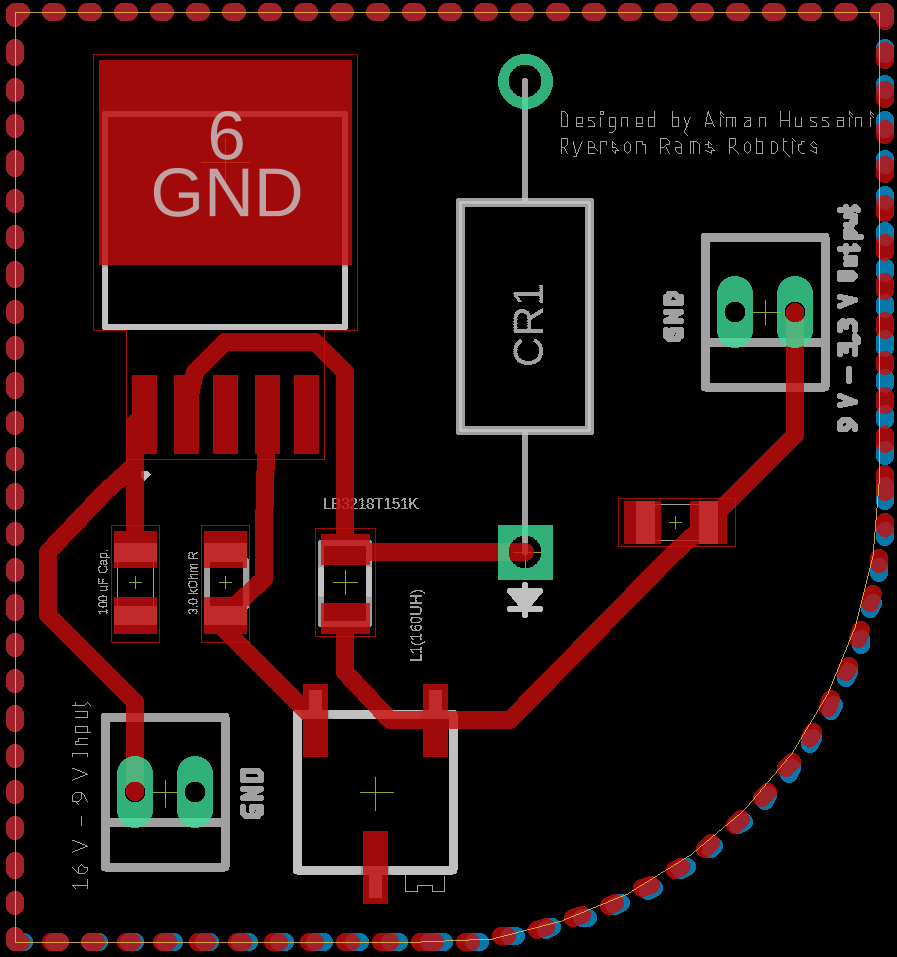

# Adjustable Voltage Step Down Board

## Functionality

- This PCB accepts inputs within a range of 16 V to 9 V and steps it down to a range between 9 V and 3.3 V
- Max Current of 1.5 A
- The user can choose the desired output voltage by adjusting the potentiometer
- All circuit component values were calculated to safely and efficiently step down voltage within the full range of input and output voltages
  
## Common Potentiometer Values
Here are some commonly desired output voltages and the corresponding potentiometer values:

| Output Voltage | Potentiometer Value |
| --- | --- |
| 9 V | 19 kΩ|
| 5 V | 9.2 kΩ |
| 3.3 V | 5.1 kΩ|        
  

## Schematics

### Board Layout Schematics:

  

### Floorplan:
